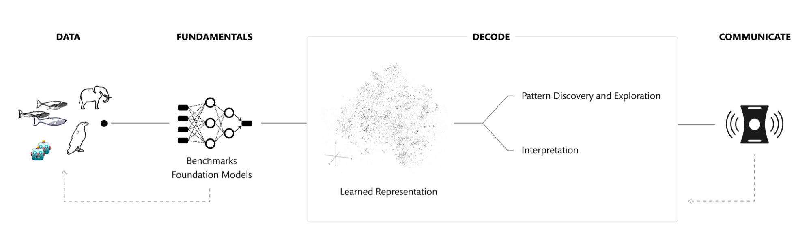
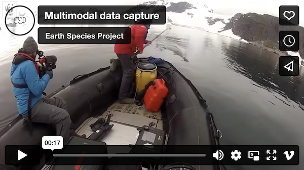

# Technical Roadmap

Earth Species Project (ESP) is a nonprofit whose mission is to use artificial intelligence to decode non-human communication. Here we present a roadmap of our proposed and ongoing scientific work, currently focused on non-human animal communication.

Machine learning (ML) has proven to be a powerful tool for learning latent representations of data ([LeCun et al., 2015](https://www.nature.com/articles/nature14539)). For example, learned representations of human languages have enabled translation between different languages without the use of dictionaries ([Artetxe et al., 2017](https://arxiv.org/abs/1710.11041); [Lample et al., 2017](https://arxiv.org/abs/1711.00043)). More recently, ML has been able to generate realistic images based on text descriptions ([DALL-E 2](https://openai.com/dall-e-2/)), as well as predict and imitate the words we speak ([AudioLM](https://ai.googleblog.com/2022/10/audiolm-language-modeling-approach-to.html)).

We hypothesize that ML models can provide new insights into non-human communication, and believe that discoveries fueled by these new techniques have the potential to transform our relationship with the rest of nature. We also expect that many of the techniques we develop will be useful tools for processing data in applied conservation settings ([Tuia et al., 2022](https://www.nature.com/articles/s41467-022-27980-y)).

### The Challenge

Unraveling meaning in non-human animal (henceforth, animal) communication is a hard problem which biologists have studied for many decades ([Bradbury and Vehrencamp, 2011](https://psycnet.apa.org/record/2011-20344-000); [Kershenbaum et al., 2014](https://onlinelibrary.wiley.com/doi/abs/10.1111/brv.12160)). Even for human languages, capturing their full diversity is still an open problem for ML ([Joshi et al., 2020](https://aclanthology.org/2020.acl-main.560.pdf)). Animals stretch our intuitions about communication even further. For example:

* Animals communicate through a variety of modalities (acoustic, visual, tactile, chemical, electrical).
* The communicative structure in animal signals may not be evident to humans (e.g. in birdsong, [Lohr, Dooling, and Bartone, 2007](https://pubmed.ncbi.nlm.nih.gov/16893261/); [Vernaleo and Dooling, 2011](https://www.ncbi.nlm.nih.gov/pmc/articles/PMC3108398/); [Prior et al., 2018](https://pubmed.ncbi.nlm.nih.gov/29670131/)).
* Unlike most human symbolic communication ([Dingemanse et al., 2015](https://pure.mpg.de/rest/items/item_2176289/component/file_2213052/content)), signal structure may be closely linked to signal meaning ([Morton, 1977](https://www.jstor.org/stable/2460385)).
* When sending signals, animals do not necessarily use syntactic rules as humans do ([Bolhuis et al., 2018](https://journals.plos.org/plosbiology/article?id=10.1371/journal.pbio.2005157); [Suzuki et al., 2018](https://journals.plos.org/plosbiology/article?id=10.1371/journal.pbio.2006532)).
* The context relevant to a signaling behavior, as well as its consequences, can extend beyond weeks or years. (e.g. in baboons, [Cheney et al., 1995](https://www.sas.upenn.edu/~seyfarth/Publications/Cheney%20et%20al.%201995a.pdf); [Rendall et al., 1999](https://www.sas.upenn.edu/~seyfarth/Publications/Rendall%20et%20al.%201999.pdf); [Wittig et al., 2007](https://www.ncbi.nlm.nih.gov/pmc/articles/pmid/17301022/)).

Using animal communication data in ML also presents a challenge. Much of ML uses data that humans generate to share on the web, so the data is easy to collect and intuitively formatted for us (e.g., text captions on images). Data from other animals are difficult to record, and in order to annotate and structure these data, we rely on the small number of scientists who have expertise with a given species. Moreover, we can only evaluate model predictions based on what is already understood about that animal’s communication and behavior. Finally, our research, from data collection to model evaluation, must be subject to thorough ethical constraints to prevent harm to the animals involved.

### Our Approach

Given these challenges, we focus on areas where scientists can use ML-based methods to:

1. reveal and explore patterns in data, and generate data-driven hypotheses about animal communication behavior; and
1. perform experiments with a level of nuance that is inaccessible using traditional methods.

In particular, our research focuses on ML techniques which help address the following questions, each a central aspect of what “decoding” means to us:

* Under what conditions does an animal produce a signal?
* How do signals influence the behavior of receivers?
* What structure in a signal is relevant for a receiver’s behavioral response?
* How do communication strategies compare between species, and between populations?

These questions give rise to specific hypotheses in the different [projects](https://www.earthspecies.org/what-we-do/projects) we work on with a variety of [scientific partners](https://www.earthspecies.org/partners#partners).

In this roadmap, we lay out the key areas of research we believe will be required to make significant progress toward two-way communication with other species. This research is divided into four major areas: Data, Fundamentals, Decode, and Communicate. There are dependencies between these areas and progress in one supports the others, so we work across all four concurrently. We hope that techniques proposed here can inform communication with other non-human species, whether plants, fungi, or others yet to be discovered.

## Data

Data form the heart of any machine learning project. The data we choose to focus on guides all other aspects of our research. We aim to identify multimodal datasets that are promising for the application of ML to decoding animal communication, and support making them widely available.

### Availability

As sensors and recording devices have become smaller and more efficient, the amount of data recorded by biologists is ever-increasing. However, these new troves of recordings are often too vast to process and analyze manually. Increasingly, researchers turn to machine learning in order to solve the problems associated with data of this scale ([Tuia et al., 2022](https://www.nature.com/articles/s41467-022-27980-y), [Stowell 2021](https://www.ncbi.nlm.nih.gov/pmc/articles/PMC8944344/)).

For ESP, this increased scale of data enables the use of powerful deep learning models. In addition to using publicly available datasets such as [FSD50K](https://arxiv.org/abs/2010.00475) and [xeno-canto](https://xeno-canto.org/), we access large datasets related to animal communication and behavior through over 40 [partnerships](https://www.earthspecies.org/partners#partners) with biologists and institutions worldwide (and growing). We work with the permission of data providers to make the data, annotations, and code publicly accessible, in order to promote a more open standard of data availability than exists at present in animal communication research ([Baker and Vincent, 2019](https://bdj.pensoft.net/article/36783/)).

### Multimodality

Like humans, animals perceive and interact with the world through multiple modalities, such as  vision, sound, smell, and touch. We predict that decoding animal communication will require data that reflects the multimodal nature of experience. Sources of multimodal data may include, but are not limited to, animal-borne bio-loggers, camera traps, third-person video recordings, and web crawls.

Focusing on multimodal data carries an additional benefit: enabling certain strategies for training models in the absence of human annotation. For example, a model can be trained to predict the data recorded in one modality, conditioned on the data recorded in another modality ([Ayter et al., 2016](https://arxiv.org/abs/1610.09001); [Arandjelović and Zisserman, 2016](https://arxiv.org/abs/1705.08168)).

## Fundamentals

There is a set of fundamental data-related challenges along the path to decoding animal communication. These include event detection, individual identification, source separation, and denoising ([Sainburg and Gentner, 2021](https://www.frontiersin.org/articles/10.3389/fnbeh.2021.811737/full)). ESP aims to contribute tools that can enable us and the broader community to solve these challenges for animal communication across various taxa.

### Benchmarks

A benchmark is a collection of tasks and datasets designed to measure the performance of ML algorithms in a standardized manner. Benchmarks spur the development of new methods and serve as a proxy for measuring the progress in a field of research. For example, benchmarks have served this purpose well in computer vision ([ImageNet](https://www.image-net.org/)), human language ([SuperGLUE](https://super.gluebenchmark.com/)), and speech processing ([SUPERB](https://superbbenchmark.org/)).

Benchmarks for fundamental challenges in animal communication research are largely absent, meaning researchers are working in silos without a way of comparing results. By developing benchmarks in collaboration with our partners (beginning with [Hagiwara et al., 2022](https://arxiv.org/abs/2210.12300)), we provide common standards for researchers developing new methods in this field. Additionally, we expect that these benchmarks will serve to draw attention of the ML community to challenges arising in biology.

### Foundation Models

Foundation models have recently become dominant in many domains of ML. These models are trained on large amounts of data, typically in a self-supervised manner ([Bommasani et al., 2022](https://arxiv.org/abs/2108.07258)). In part due to the scale of data, these models can perform difficult predictive and generative tasks (e.g., [Brown et al., 2020](https://arxiv.org/abs/2005.14165); [Radford et al., 2021](https://arxiv.org/abs/2103.00020)). These models are also useful for domains with less data, as they often exhibit state-of-the-art performance when fine-tuned for specific applications (e.g. [Chen et al., 2020](http://proceedings.mlr.press/v119/chen20s/chen20s.pdf)). More generally, models trained using self-supervision do not rely on the availability of human annotations. This makes self-supervision well-suited for problems in bioacoustics and animal behavior, where annotated data are scarce.

Beginning with the AVES model ([Hagiwara, 2022](https://arxiv.org/abs/2210.14493)), ESP will develop large foundation models focused on biological data. We will release them as open-source tools for the wider research communities. These models will give us powerful general tools for addressing fundamental challenges related to the decoding of animal communication.

## Decode

Working with our partners, we develop and apply new ML-powered methods for better understanding animal communication. In particular, we focus on methods for the discovery of latent patterns and for data interpretation.

Animal communication is influenced by factors which challenge today’s machine learning systems ([Bisk et al., 2020](https://arxiv.org/abs/2004.10151)), such as long-term temporal context, social structure, selective pressures, and life history. We intend for scientists to use the ML methods we develop within a holistic approach that accounts for the wider biological context.

## Patterns

We develop self-supervised ML models for discovering patterns in animal behavior data. These techniques will help reveal patterns in when animals send signals, as well as how these signals influence behavior. For example, ESP is developing models to predict an individual’s motion conditioned on that individual’s vocal behavior (and vice versa), potentially revealing when an animal’s vocalizations are predictive of its behavior.

<figure>

<figcaption>
By selecting the correct way to complete an animal’s vocalization, given its motions and its previous vocalizations, a model can learn associations between behaviors across modalities
</figcaption>

</figure>

Another self-supervised approach, called clustering, focuses on grouping data with similarities. ESP is currently adapting deep clustering techniques (e.g. [Ji et al., 2019](https://arxiv.org/abs/1807.06653)) to automatically generate an inventory of an animal’s behavior ([automated ethogram discovery](https://www.earthspecies.org/blog/self-supervised-ethogram-discovery)) from motion bio-logger data, and plan to apply similar techniques to vocal behavior. Quantifying these behavioral repertoires can enable comparative studies between species and populations.

Because these methods are intended to reveal new patterns in data, we will validate their performance in well-understood contexts, including in benchmark datasets with human annotations.

### Interpretation

ML can enable new ways to interpret how vocal signals vary in the wild, and how this variation relates to signal meaning. ESP is developing techniques inspired by recent work in computer vision ([Lang et al., 2021](https://explaining-in-style.github.io)) that visualizes the signal variations that are most important for ML-based classification. An analogous approach, sketched in the next figure, could help scientists form hypotheses for how a signal’s acoustic structure relates to its communicative function.

<figure>

<figcaption>

Mockup of a tool for the exploration of acoustic features of animal vocal communication. In one potential use case, a supervised classification model predicts which individual made the recorded vocalization. The sliders at the right alter the acoustic features of the vocalization which were highly influential to the classifier’s prediction. The scientist can explore these features by adjusting the sliders, and investigate how to discriminate between vocalizations coming from different individuals. This could help reveal how individuals encode identity in their signature vocalizations (in e.g. [Vergara and Mikus, 2018](https://onlinelibrary.wiley.com/doi/10.1111/mms.12538); [Wanker et al., 2005](https://www.sciencedirect.com/science/article/abs/pii/S000334720500093X); [Jansen et al., 2012](https://bmcbiol.biomedcentral.com/articles/10.1186/1741-7007-10-97))

</figcaption>

</figure>

Models which make cross-modal predictions often do so by learning to represent both modalities in a single shared representation of the data (e.g. [Radford et al., 2021](https://arxiv.org/abs/2103.00020)). These shared representations provide a second method of data interpretation: if two different communication systems are grounded in a shared modality, that modality can be used as a ‘pivot’ to translate between those systems. As an example, population-specific vocalizations or ‘dialects’ have been documented for several species ([Henry et al., 2015](https://www.researchgate.net/publication/284134371_Dialects_in_Animals_Evidence_Development_and_Potential_Functions); [Podos and Warren, 2007](https://www.sciencedirect.com/science/article/abs/pii/S0065345407370095)). Predicting an animal’s motion based on their vocalizations may enable translation between the dialects of two populations, by using motion as the pivot. Recently, a similar approach was used in the human domain to extend self-supervised translation with monolingual data by pivoting through images ([Dinh et al., 2022](https://arxiv.org/abs/2205.11616)).

Finally, simulation and reinforcement learning in physically realistic virtual environments may allow us to reproduce and examine aspects of animal communication and behavior in a controlled environment (e.g., [Whitehead and Lusseau, 2012](https://pubmed.ncbi.nlm.nih.gov/22051567/)). Simulation can also be leveraged for data augmentation when the training signals are sparse ([de Melo et al., 2021](https://www.sciencedirect.com/science/article/abs/pii/S136466132100293X); [Winkler et al., 2022](https://arxiv.org/abs/2209.09391)), as well as for studying the emergence and the evolution of communication systems ([Lazaridou and Baroni, 2020](https://arxiv.org/abs/2006.02419)).

## Communicate

Playback experiments are a popular tool to test hypotheses about communication in the context of animal behavior. In a playback experiment, an experimenter presents communication signals to an animal, and observes the receiver’s behavioral response. Such experiments can reveal how animals perceptually discriminate between signals (e.g. [Sayigh et al., 2017](https://www.ncbi.nlm.nih.gov/pmc/articles/PMC5640738/)) and how communication alters behavior (e.g. [Seyfarth, Cheney, and Marler, 1980](https://www.sciencedirect.com/science/article/abs/pii/S0003347280800972)). ESP aims to design ML models that enable nuanced playback experiments, and to work with partners on developing ethical frameworks that promote positive use of ML-generated communication.

### Signal Generation

In acoustic playbacks, vocalizations are typically recorded before an experiment ([McGregor, 2000](https://link.springer.com/article/10.1007/s102110000023)). Currently, modifications of these pre-recorded sounds rely on traditional audio processing techniques. We aim to introduce new ML-based models which allow for more sophisticated signal modifications (e.g. [Kameoka et al., 2018](https://ieeexplore.ieee.org/abstract/document/8639535); [Engel et al., 2020](https://arxiv.org/abs/2001.04643); [Karras et al., 2018](https://arxiv.org/abs/1812.04948)).

Interactive playback experiments, in which the presentation of vocalizations varies in real-time in response to the animal’s behavior, can reveal the role of ongoing interactions in driving communication ([King, 2015](https://www.ncbi.nlm.nih.gov/pmc/articles/PMC4528452/)). For human vocal communication, recent work shows how an ML model can learn to generate realistic continuations of short segments of speech ([Borsos, 2022](https://arxiv.org/abs/2209.03143)). Extending such an approach beyond human speech could establish highly sophisticated paradigms for interactive experiments, in which an ML model interacts directly with an animal.

### New Ethical Questions

Playback experiments carry the risk of causing harm to an animal, for example by influencing their behavior in such a way that they lose a foraging or mating opportunity. For this reason, all playback experiments will be performed in partnership with biologists. Where established ethical frameworks ([Cuthill, 1991](https://www.sciencedirect.com/science/article/abs/pii/S0003347205801538); [Putnam, 1995](https://link.springer.com/article/10.1007/BF00056197)) hold, we will work within those frameworks in collaboration with biologists on their species of study.

As it has in the human domain (e.g. [Meskys et al, 2019](https://papers.ssrn.com/sol3/papers.cfm?abstract_id=3497144), [Bender et al., 2021](https://dl.acm.org/doi/10.1145/3442188.3445922)), the act of generating communicative signals of animals raises new ethical questions. For example, in social species with vocal learning, experiments may run the risk of altering culture by introducing novel calls that spread in wild populations ([Garland and McGregor, 2020](https://www.frontiersin.org/articles/10.3389/fpsyg.2020.544929/full)). To mitigate these risks, we will focus on captive populations, and populations whose vocal communication is not socially learned. Where established ethical frameworks do not hold, we will work with biologists, ethicists, and governance bodies to establish a set of norms, rules, and regulations.

## Acknowledgement

We thank Damian Blasi, Julien Cornebise, Michelle Fournet, Steven Moran, Sebastian Ruder, Christian Rutz, Robert Seyfarth, and John Thickstun for helpful comments in the process of creating this roadmap. We also thank Peter Bermant for his input.
